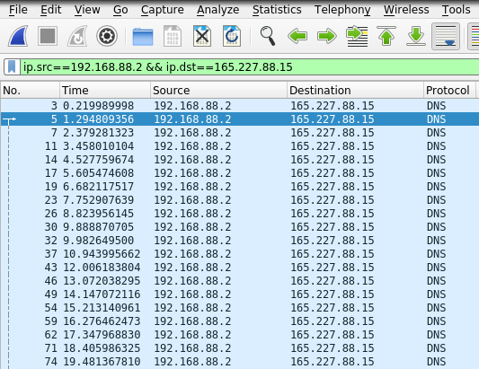
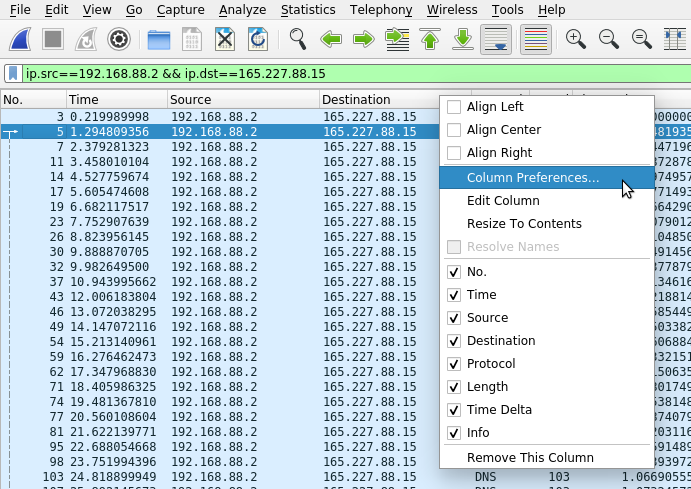
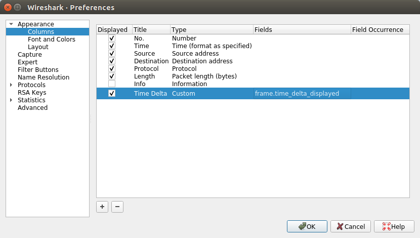
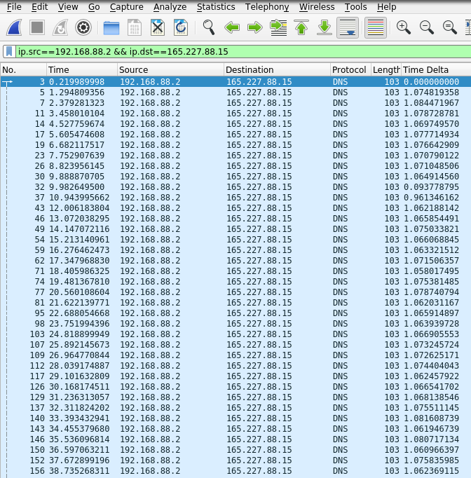
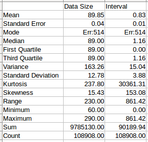
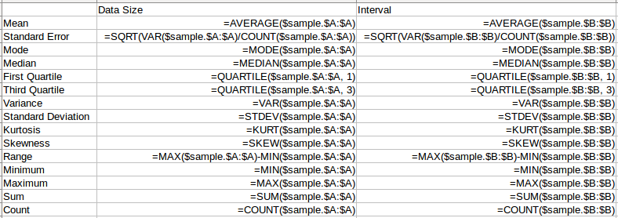
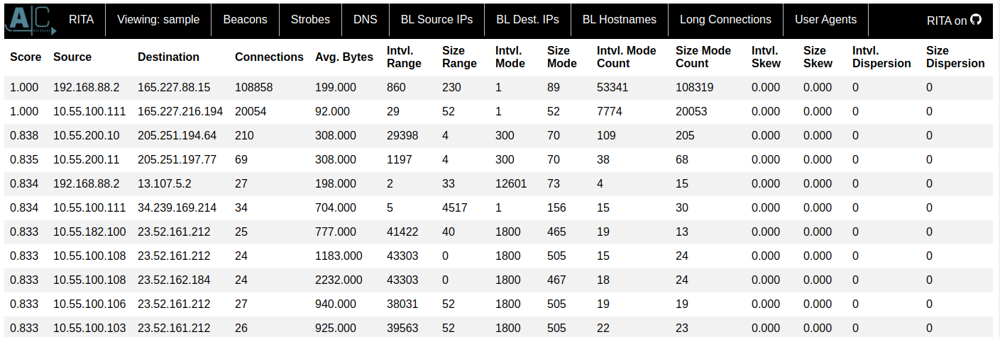

## Goal

Identify command & control (C2) sessions using regular connections between two IP addresses.

## Tools Used

* Wireshark
* Tshark
* Spreadsheet program (e.g. LibreOffice Calc)
* RITA

## Hunt

We're going to find the connections that happen on regular time intervals. These could indicate an attacker with a persistent C2 session.

During this lab, we will be analyzing traffic between two particular systems: `192.168.88.2` and `165.227.88.15`. You'd use the techniques in this lab after identifying systems with suspiscious traffic between then, such as systems with a large number of connections or data sent.

### Wireshark

Open your pcap in Wireshark. This loads every individual packet in the main window.

Apply the filter `ip.src==192.168.88.2 && ip.dst==165.227.88.15`. This exercise is meant to illustrate the process that is automated with tools such as [RITA](#RITA). Your window should now look something like this:



If you look at the Time column, you can already see a pattern emerge. The seconds increase by 1 pretty consistently.

Open the Column Preferences by right-clicking on one of the columns (e.g. Destination) and selecting Column Preferences from the menu.

 

Inside the preferences, click the + button to add a new item and make it match the entry shown below with "Time Delta" for the title and "frame.time_delta_displayed" in the Fields column. You need to double-click inside the box to edit the values. Then uncheck the Info/Information line to temporarily hide that item and click OK.



You should then see a new column that contains the difference in times between each packet and the previous one.



Our previous hunch that most packets are 1 second apart is confirmed. This shows that the IP `192.168.88.2` was communicating with `165.227.88.15` consistently on a 1 second interval.

### Tshark

Tshark is the command line equivalent of Wireshark. We can use it to process pcaps and pull out different fields using its protocol dissectors. This is useful if we want to use other tools to manipulate the data.

```bash
tshark -r sample.pcap -T fields -e ip.src -e ip.dst -e udp.dstport -e frame.time_delta_displayed 'ip.src==192.168.88.2 && ip.dst==165.227.88.15' | head -25
```

```
192.168.88.2	165.227.88.15	53	0.000000000
192.168.88.2	165.227.88.15	53	1.074819358
192.168.88.2	165.227.88.15	53	1.084471967
192.168.88.2	165.227.88.15	53	1.078728781
192.168.88.2	165.227.88.15	53	1.069749570
192.168.88.2	165.227.88.15	53	1.077714934
192.168.88.2	165.227.88.15	53	1.076642909
192.168.88.2	165.227.88.15	53	1.070790122
192.168.88.2	165.227.88.15	53	1.071048506
192.168.88.2	165.227.88.15	53	1.064914560
192.168.88.2	165.227.88.15	53	0.093778795
192.168.88.2	165.227.88.15	53	0.961346162
192.168.88.2	165.227.88.15	53	1.062188142
192.168.88.2	165.227.88.15	53	1.065854491
192.168.88.2	165.227.88.15	53	1.075033821
192.168.88.2	165.227.88.15	53	1.066068845
192.168.88.2	165.227.88.15	53	1.063321512
192.168.88.2	165.227.88.15	53	1.071506357
192.168.88.2	165.227.88.15	53	1.058017495
192.168.88.2	165.227.88.15	53	1.075381485
192.168.88.2	165.227.88.15	53	1.078740794
192.168.88.2	165.227.88.15	53	1.062031167
192.168.88.2	165.227.88.15	53	1.065914897
192.168.88.2	165.227.88.15	53	1.063939728
192.168.88.2	165.227.88.15	53	1.066905553
```

The `tshark` arguments are:

* `-r sample.pcap` - The path to your pcap file.
* `-T fields` - Tell tshark to output values of the specified fields.
* `-e ip.src -e ip.dst -e udp.dstport -e frame.time_delta_displayed` - These options are telling `tshark` which fields should be printed. In this case, we want the source and destination IP, the destination port (you could also try `tcp.dstport`) and the time since the previous packet was sent. This syntax is the same as used in Wireshark. You can find a list of all fields in [Wiresharks' documentation](https://www.wireshark.org/docs/dfref/).
* `ip.src==192.168.88.2 && ip.dst==165.227.88.15` - The filter to be used. This uses [Wireshark's display filter syntax](https://wiki.wireshark.org/DisplayFilters). In this case we are telling tshark to only process packets sent from `192.168.88.2` to `165.227.88.15`.

For instance, you could use the following command to output all the packet sizes and the time intervals to a CSV file.

```bash
tshark -r sample.pcap -T fields -E separator=, -e ip.len -e frame.time_delta_displayed 'ip.src==192.168.88.2 && ip.dst==165.227.88.15' > sample.csv
```

And then open the file in a spreadsheet program and calculate some basic statistics, such as the min, max, mean, and standard deviation of the data.



Hint: Here are the formulas used in the above example. But you can have them automatically generated in LibreOffice Calc by using Data -> Statistics -> Descriptive Statistics menu item.



### RITA

RITA calculates various statistical measures for both the time interval between connections and the size of each connection.

If you haven't already, generate Zeek logs from the pcap, and import the Zeek files as described in the [Basic Tool Usage]() document.

The dataset name in this example is "sample".

```bash
rita show-beacons sample | head
```

```
Score,Source IP,Destination IP,Connections,Avg Bytes,Intvl Range,Size Range,Top Intvl,Top Size,Top Intvl Count,Top Size Count,Intvl Skew,Size Skew,Intvl Dispersion,Size Dispersion
1,192.168.88.2,165.227.88.15,108858,199,860,230,1,89,53341,108319,0,0,0,0
1,10.55.100.111,165.227.216.194,20054,92,29,52,1,52,7774,20053,0,0,0,0
0.838,10.55.200.10,205.251.194.64,210,308,29398,4,300,70,109,205,0,0,0,0
0.835,10.55.200.11,205.251.197.77,69,308,1197,4,300,70,38,68,0,0,0,0
0.834,192.168.88.2,13.107.5.2,27,198,2,33,12601,73,4,15,0,0,0,0
0.834,10.55.100.111,34.239.169.214,34,704,5,4517,1,156,15,30,0,0,0,0
0.833,10.55.182.100,23.52.161.212,25,777,41422,40,1800,465,19,13,0,0,0,0
0.833,10.55.100.108,23.52.161.212,24,1183,43303,0,1800,505,15,24,0,0,0,0
0.833,10.55.100.108,23.52.162.184,24,2232,43303,0,1800,467,18,24,0,0,0,0
```

In this case, the ascii table output is not as useful as it is too wide. However, you can pipe the output to a new CSV file and open it in a spreadsheet program. This will give you the flexibility to filter and sort based on different columns.

```bash
rita show-beacons sample > sample.csv
```

Or you can export the results to an [HTML report]() and view the data in a web browser.



The different columns are as follows:

* **Score** - The score is a metric calculated by taking into account the interval skew, dispersion, and duration as well as the data size skew, dispersion, and mode. The closer this score is to 1 the more likely that this is beaconing activity.
* **Source** - IP address that initiated the connections.
* **Destination** - IP address that received the connections.
* **Connections** - The total number of connections between the source and destination IPs.
* **Avg Bytes** - The average number of bytes transferred in either direction per connection.
* **Intvl Range** - This is the difference between the maximum and minimum time intervals seen. For instance, if there were 2 connections 80 seconds apart and another 2 connections 20 seconds apart then the entire range of intervals would be 80-20 = 60 seconds. This is useful to know how spread out or close together the connections are, but it is easily thrown off by missed connections.
* **Size Range** - This is the difference between the maximum and minimum connection sizes seen.
* **Top Intvl (CSV) / Intvl Mode (HTML)** - The interval between connections that we saw the most.
* **Top Size (CSV) / Size Mode (HTML)** - The number of bytes transferred in a connection that we saw the most.
* **Top Intvl Count (CSV) / Intvl Mode Count (HTML)** - How many times we saw the interval mode.
* **Top Size Count (CSV) / Size Mode Count (HTML)** - How many times we saw the size mode.
* **Intvl Skew** - Skew measures how distorted or asymmetric the data is. A value closer to 0 means that the data is very symmetric. This measure is useful in the case of malware that does not try to hide itself, but more importantly will detect malware that tries to hide by adding jitter. This works because malware with jitter most likely uses a random number generator to add or subtract to a mean value (e.g. 30 seconds +/- 5 seconds). The random number generator will uniformly distribute the values which causes the data to be symmetric, and as such this particular measure is hard to beat.
* **Size Skew** - Skew of the connection data sizes. Skew isn't as important of a measure for data sizes because we expect them to naturally vary if an attacker is actively sending commands or transferring data via a C2 session. But the majority of the time we expect the C2 session to be simply checking in.
* **Intvl Dispersion** / **Size Dispersion** - Dispersion describes how likely it is that an interval or data size is to stray from the mean (very similar to standard deviation from the mean). A value closer to 0 means that most intervals or data sizes were clustered around the mean and had very little variation. This is useful in the case of beacons that don't make any effort to hide themselves by changing their beacon interval or data sizes. The more jitter added to a beacon, the less effective dispersion is.
